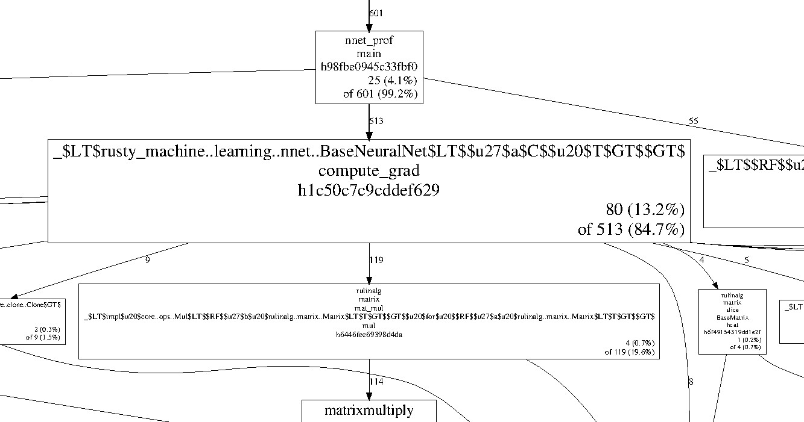

# CPU Profiler

This library provides bindings to google's [cpuprofiler](http://goog-perftools.sourceforge.net/doc/cpu_profiler.html).

## Why use this?

There are other profiling tools for Rust, [cargo-profiler](https://github.com/pegasos1/cargo-profiler) is particularly good!
This library certainly doesn't replace those but adds a some different tools to the mix:

- Makes it easy to profile only sections of code
- Uses statistical sampling (like [oprofiler](http://oprofile.sourceforge.net/news/)) which means low overhead
- Works with [pprof](https://github.com/google/pprof) for a range of output formats

## Installation

In order to use this library you will need to install [gperftools](https://github.com/gperftools/gperftools). There are instructions
in their repository but it's roughly the following:

1. Download package from [releases](https://github.com/gperftools/gperftools/releases)
2. Run `./configure`
3. Run `make install`

There may be some other dependencies for your system - these are explained well in their
[INSTALL](https://github.com/gperftools/gperftools/blob/master/INSTALL) document.
For example [libunwind](http://download.savannah.gnu.org/releases/libunwind/) (> 0.99.0) is required for 64 bit systems.

## Usage

Add `cpuprofiler` to your `Cargo.toml` manifest.

```
[dependencies]
cpuprofiler = "0.0.3"
```

Add the dependency to your root:

```
extern crate cpuprofiler;
```

Start and stop the profiler around the code you'd like to draw samples.
This will save the profile to a file you specify.

```rust
use cpuprofiler::PROFILER;

PROFILER.lock().unwrap().start("./my-prof.profile").unwrap();
// Code you want to sample goes here!
PROFILER.lock().unwrap().stop().unwrap();
```

Now you can just run the code as you would normally. Once complete the profile will be saved to `./my-prof.profile`.

The final step is the fun part - analyzing the profile!

### Analyzing the profile

To analyze the profile we use google's [pprof](https://github.com/google/pprof) tool.

An old version of this tool is included with the gperftools package. This is the version I have been using but the newer Go version should work too!
The usage of pprof is well documented in the [cpuprofiler docs](http://goog-perftools.sourceforge.net/doc/cpu_profiler.html).

## The Result

The output format is entirely dependent on [pprof](https://github.com/google/pprof) but here are some examples from a Rust program:

#### Text

```
Total: 855 samples
     207  24.2%  24.2%      207  24.2% matrixmultiply::gemm::masked_kernel::hfdb4f50027c4d91c
     156  18.2%  42.5%      853  99.8% _$LT$rusty_machine..learning..optim..grad_desc..StochasticGD$u20$as$u20$rusty_machine..learning..optim..OptimAlgorithm$LT$M$GT$$GT$::optimize::h2cefcdfbe42a4db8
      79   9.2%  51.7%       79   9.2% _$LT$$RF$$u27$a$u20$rulinalg..vector..Vector$LT$T$GT$$u20$as$u20$core..ops..Mul$LT$T$GT$$GT$::mul::h21ce4ecb4bbcb555
      66   7.7%  59.4%       73   8.5% __ieee754_exp_sse2
      61   7.1%  66.5%       95  11.1% _$LT$rusty_machine..learning..toolkit..regularization..Regularization$LT$T$GT$$GT$::l2_reg_grad::h4dff2e22567a587e
      57   6.7%  73.2%      274  32.0% matrixmultiply::gemm::dgemm::h2d985771431fcfd4
      41   4.8%  78.0%       42   4.9% _$LT$rulinalg..matrix..Matrix$LT$T$GT$$GT$::transpose::h736b18b122958bcd
      31   3.6%  81.6%       32   3.7% sdallocx
```

The first column is the number of samples from each function.
The second is the percentage of samples which were found directly in this function, and the third column is the
percentage of samples which were in this function or it's children. _I think..._

#### Graphviz

Below is a snippet of an interactive graph output.



The above graph is produced by pprof and shows which functions the samples belong too.
In the above we see that there were 513 samples in the `compute_grad` function and 119 of these were matrix multiplication.

### TODO

- Better crate documentation
- Expose other functions from google's cpuprofiler. This allows more options, status checks and more.
- Can we write a sampling profiler in Rust?!
- Integration with cargo-profiler?

## License

This project has a BSD license to match the gperftools license. Which makes sense, I think?
